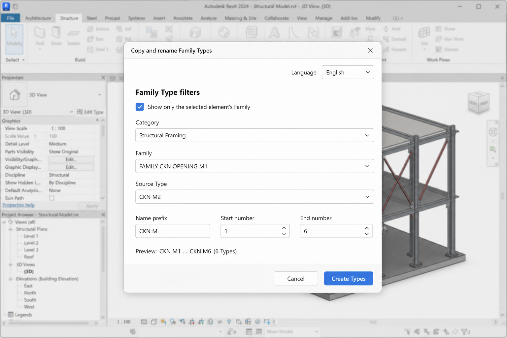

# Revit Family Type Duplicator

A lightweight Revit add-in for duplicating and batch-renaming Family Types. It provides cascading Category, Family, and Type filters, automatic numbering, duplicate-name protection, and Vietnamese/English UI support.

> Tiện ích Revit giúp nhân bản và đặt tên Family Type hàng loạt, có bộ lọc theo Category/Family/Type và giao diện tiếng Việt–tiếng Anh.



## Features

- Duplicate a source Family Type while preserving its parameters.
- Generate numbered names such as `CKN M1` through `CKN M6`.
- Filter source Types by Category and Family.
- Optionally show only the Family of the selected model element.
- Preview generated names before committing changes.
- Skip names that already exist in the source Family.
- Switch the interface between Vietnamese and English.
- Build separately against the installed Revit API for versions 2024–2027.

## Supported Revit versions

| Revit | Runtime |
| --- | --- |
| 2024 | .NET Framework 4.8 |
| 2025–2026 | .NET 8 |
| 2027 | .NET 10 |

Each Revit version requires its own build because Autodesk Revit API assemblies are version-specific.

## Requirements

- Windows
- Autodesk Revit 2024, 2025, 2026, or 2027
- A compatible .NET SDK
- PowerShell

## Build and install

Open PowerShell in the repository directory:

```powershell
.\Build-All.ps1
.\Install.ps1
```

`Build-All.ps1` detects supported Revit installations and builds a separate DLL for each installed version. `Install.ps1` creates the corresponding `.addin` manifest under:

```text
%APPDATA%\Autodesk\Revit\Addins\<RevitVersion>
```

Restart Revit, then open the **CopyFam** ribbon tab.

## Usage

1. Optionally select a Family Instance in the model.
2. Open **CopyFam** and click **Copy & rename**.
3. Choose the language and filter by Category, Family, and source Type.
4. Enter a name prefix and start/end numbers.
5. Review the preview and click **Create Types**.

Existing names are skipped automatically.

## Hướng dẫn nhanh

1. Có thể chọn trước một Family Instance trong mô hình.
2. Mở tab **CopyFam** và bấm **Copy & đặt tên**.
3. Chọn Category, Family và Type nguồn.
4. Nhập tên gốc cùng khoảng số cần tạo.
5. Kiểm tra phần xem trước rồi bấm **Tạo Type**.

Các tên đã tồn tại sẽ được tự động bỏ qua.

## Project structure

```text
CopyFam.csproj                 Multi-version build configuration
App.cs                         Revit ribbon registration
DuplicateTypesCommand.cs       Revit transaction and duplication logic
DuplicateTypesWindow.xaml      WPF interface
Build-All.ps1                  Detect and build installed Revit versions
Install.ps1                    Install version-specific manifests
```

## Notes

- Close Revit before rebuilding or replacing a loaded DLL.
- The screenshot is an interface mockup; Family and Type names depend on the active Revit project.

## License

No license has been specified yet.
